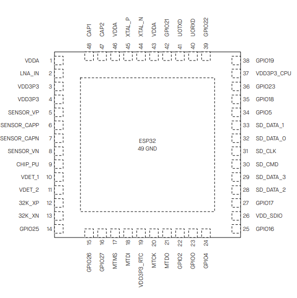
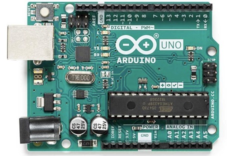

# Processing: Microcontroller, Microprocessor

For processing we need a computer. Different purposes require different computers. E.g. your laptop has a different purposes than the one in your phone or the camera.

## Microcontroller

In physical computing very often a microcontroller is used.

* Are optimized for control of physical input and output.
* Small, very simple and receives information through sensors, controls basic motors and sends information to other devices.
* Found in everything e.g. washing machines, light switches, keyboards and computer mice.
* Don't have an operating system, just run one program (that you will program onto the controller from a personal computer using a dedicated hardware programming device).
* Come in different layouts and sizes but need a so called development board to operate:
    * The Processor Itself
    * Power Regulation Circuitry
    * Hardware Programmer Connector
    * Communications Interface Circuitry

## Examples:
### ESP32
  

  

Microcontroller with integrated Wi‑Fi and Bluetooth, designed for IoT and embedded applications. (Used also in this class)

### Arduino Uno (development board)
  

## Microprocessor

### [Raspberry Pi](http://raspberrypi.org)  

More powerful: Microprocessor

* A computer.

* Needs periphery (RAM, memory).

* Runs an operating system. 

* Cost-effective and fully-fledged personal computer.

We will use it also in class embedded in a small driving robot.

## Pin Functions of Microcontroller

Microcontrollers can have between 6 and 60 pins:

* Attach power connections.
* Input and output connections.
* Communications connections. 

Every microcontroller has different configurations for its pins, and often one pin will have more than one function. 

### ESP32 Pin Layers

| Pin Layer | Description | What It Refers To |
|---|---|---|
| **ESP32-WROOM-32 Module pins** | The **38 physical pads** on the **metal-cased module itself** | These are directly connected to the ESP32 chip inside the module |
| **Development board pins** | The **header pins** (e.g., “GPIO 21”, “VIN”, “3V3”) on your **DevKit** | These are **mapped** to the module pins, sometimes with naming differences or extra components in between |

You can find more details on this [page.](https://itp.nyu.edu/physcomp/resources/microcontroller-pin-functions/){target = "_blank"}

