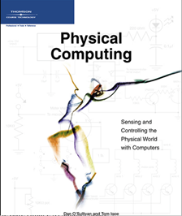

The theory of the course is based on the book:

O̕'Sullivan, Dan; Igoe, Tom: Physical computing : Sensing and Controlling the Physical World with Computers, Boston, Mass. : Thompson, 2004

Other references are noted along.