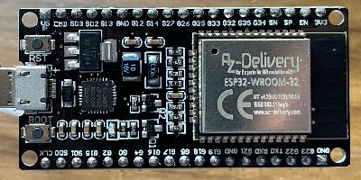
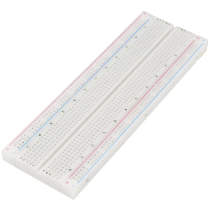
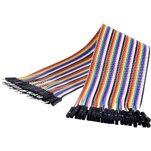
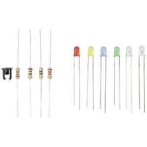

# Working with ESP32 devices

## Overview

The ESP32 is a powerful microcontroller with built-in touch capabilities, making it ideal for physical computing projects. In this section, we will cover the basics of working with ESP32 devices, including setting up the development environment, programming the device, and interfacing with various input and output components.

## Gather the hardware components

1. ESP32 Development Board

    

2. USB Cable (for programming and power)

    

3. Breadboard and wires

    

4. Input components (we simply use wires as touch sensors)

    

5. Output components (we use LEDs and therefore we need resistors)

    

6. Computer for programming the ESP32 and applications

## Setting Up the Development Environment

We want to program the ESP32 using the Arduino IDE. Therefore, we need to install the Arduino IDE and set it up for ESP32 development.

### Installing or Updating the Arduino IDE

1. Download the latest version of the Arduino IDE from the [official Arduino website](https://www.arduino.cc/en/software). Choose the version that matches your operating system (Windows, macOS, or Linux). This guide has been written using Arduino IDE version 2.3.6 on MacOS.

### Installing USB to Serial Drivers

Check if your board has a built-in USB to Serial converter. Most ESP32 boards use the CP210x or CH340 chip for USB to Serial communication. If your board uses one of these chips, you may need to install the appropriate drivers.

Here is an image of the CP210x chip:


You can download the USB to Serial drivers from the Silicon Labs website: [Silicon Labs USB to UART Bridge VCP Drivers](https://www.silabs.com/software-and-tools/usb-to-uart-bridge-vcp-drivers?tab=downloads). Choose the appropriate driver for your operating system (Windows, macOS, or Linux) and follow the installation instructions provided on the website.

### Installing the ESP32 Board Package in Arduino IDE

1. Open the Arduino IDE.
2. Go to `File` > `Preferences` (on macOS, `Arduino` > `Settings`).
3. In the "Additional Boards Manager URLs" field, add the following URL:

```plaintext
https://dl.espressif.com/dl/package_esp32_index.json
```

If there are already URLs in the field, separate them with a comma.
4. Click "OK" to close the Preferences window.
5. Open the Boards Manager by going to `Tools` > `Board` > `Board Manager`.
6. In the Boards Manager, search for "ESP32" and install the "ESP32 by Espressif Systems" package. When writing this guide, the latest version is 3.3.3.

### Selecting the ESP32 Board

After installing the ESP32 board package, use the "Select board" dropdown to choose your specific ESP32 board model from the list. For the ESP32-Wroom-32, select "ESP32 Dev Board".

Your IDE should now look similar to this:


It shows the selected board "ESP32 Dev Module" (blue rectangle) and the port "/dev/cu.SLAB_USBtoUART" (green rectangle; this may vary depending on your system). In the center you see the code editor where you can write your sketches. On the top left you find buttons (orange rectangle) to verify (check mark) and upload (right arrow) your code to the ESP32.

### Writing Your First ESP32 Sketch: Blink the on-board LED

Edit the code editor to contain the following code:

```cpp
int ledPin = 2; // the pin of the on-board LED

void setup() {
  Serial.begin(115200); // use serial connection to debug
  Serial.println("Setup"); // to check in serial monitor
  pinMode(ledPin, OUTPUT); // set pin 2 as output
}

void loop() {
  digitalWrite(ledPin, HIGH); // sets pin to high voltage (ON)
  delay(500); // wait half a second
  digitalWrite(ledPin, LOW); // set pin to low voltag (OFF)
  delay(500); // wait again
  Serial.println("I am alive"); // to check in serial monitor
}
```

This code will blink the on-board LED of the ESP32 every second. But first we need to verify and then upload the code to the ESP32. Directly after uploading the on-board LED should start blinking. You can also open the Serial Monitor (magnifying glass icon on the top right) to see the debug messages from the ESP32.

Now you have successfully set up your development environment and programmed your ESP32 to blink an LED! You can now proceed to explore more complex projects and functionalities of the ESP32.
